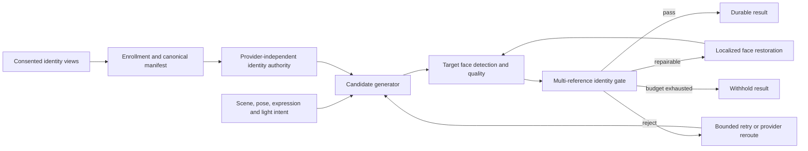

# MIRAVA Identity Fidelity Core

Status: ACCEPTED FOR IMPLEMENTATION
Date: 2026-08-09
Scope: consented adult identity profiles only

## Decision

MIRAVA treats every image provider as a candidate generator, never as the
authority that decides whether an image is deliverable. A provider-independent
Identity Fidelity Core owns enrollment, canonical references, target-face
detection, localized restoration, scoring, rejection and private evidence.

The product does not promise a literal mathematical 100% identity match for an
arbitrary pose or occlusion. It promises a stricter and testable behavior:
MIRAVA does not deliver a candidate that has not passed the calibrated identity
gate for its pose/quality cohort. A failed candidate is restored, regenerated,
rerouted or withheld.

## Exact divergence observed on 2026-08-09

Observation:

1. The identity profile requires front, angle and right-profile views.
2. MediaPipe face geometry is persisted and used to build deterministic face
   crops for the KIE route.
3. Pass A is stored durably and a local restoration crop is prepared.
4. The artistic-reference route then returns the unchanged Pass A artifact.
5. The OpenAI route still submits full identity photographs and returns the
   first provider image without a face-identity quality gate.
6. No provider route computes a candidate-to-profile similarity score before a
   RESULT becomes durable.

Inference:

The principal identity loss is not attributable to one prompt sentence. The
pipeline has no downstream authority capable of observing drift and preventing
delivery. The current crop preparation is useful infrastructure, but it is not
an executed restoration or verification system.

## Architecture

### 1. Enrollment manifest

The server creates a versioned manifest from the consented profile:

- immutable asset hashes and profile version;
- canonical view role and capture quality;
- face bounding box, landmarks and head pose;
- canonical aligned crops;
- embeddings produced by each approved commercial evaluator;
- model name, weight digest and preprocessing version;
- enrollment timestamp and consent version.

Embeddings, signed identity URLs and biometric diagnostics remain server-only.
They must never enter a browser DTO, prompt log or analytics event.

### 2. Generation contract

Every adapter receives the same logical inputs: identity manifest, target pose
and expression, scene contract and provider-specific limits. Provider output is
named `CANDIDATE`; only the fidelity gate may promote it to `RESULT`.

The high-fidelity path is:

1. Pass A generates composition, body, wardrobe, environment and light.
2. The candidate face is detected on Pass A itself. Geometry copied from the
   artistic reference is not accepted as proof of the generated face position.
3. Pass B edits only a padded face/head region using canonical identity views.
4. The restored region is blended back into the immutable Pass A canvas.
5. The verifier re-detects and re-scores the composite.

Pixels outside the authorized restoration region must remain semantically and
geometrically unchanged. A full-frame second pass is forbidden.

### 3. Gate decision

The gate uses an ensemble rather than one opaque score:

- multi-reference face-embedding similarity;
- landmark and stable-ratio residuals;
- face detection confidence and usable pixel area;
- pose, occlusion and blur cohort;
- optional reviewer decision for benchmark calibration.

Thresholds are learned from a consented validation set. They are versioned by
evaluator and cohort; they are not invented as a universal percentage. Failures
are fail-closed when the gate is required.

### 4. State machine

`PASS_A_READY -> FACE_DETECTED -> SCORED -> RESTORING -> RESCORED -> ACCEPTED`

Terminal alternatives are `REJECTED_BUDGET` and `REJECTED_UNSCORABLE`. Worker
retries resume the last durable state and never regenerate an existing Pass A
merely because a restoration or scoring request timed out.

### 5. Deployment boundary

Next.js remains the orchestrator and source of truth. GPU/ONNX inference runs in
a private identity service because Vercel functions are not the correct runtime
for large face encoders or diffusion adapters. The service accepts authenticated
private requests, returns scores and regions but never returns raw embeddings.

The first evaluator candidates are AuraFace and OpenCV SFace because their
published model artifacts declare Apache-2.0/commercial use. Their real MIRAVA
performance and demographic behavior still require calibration. InstantID,
InsightFace pretrained packs, PuLID and PhotoMaker V2 are excluded from the
commercial production path unless every transitive model/data license is
cleared in writing.

DreamO is an experimental generator candidate, not the initial authority. Its
official code is Apache-2.0 and its ID mode targets facial identity, but base
model, weight and hosting terms must be cleared independently before adoption.

## Reliability and privacy invariants

- No consent means no external biometric processing.
- No configured verifier means no high-fidelity PASS.
- No detected face, multiple unexpected faces or an out-of-cohort sample means
  `UNSCORABLE`, never an automatic pass.
- Retry count and provider spend are bounded.
- Logs contain IDs, hashes, model versions, scores and reason codes only.
- Temporary crops and provider URLs are deleted only after RESULT durability or
  terminal cleanup.
- Profile deletion also deletes manifests, embeddings and derived crops.

## Rejected alternatives

### Prompt-only identity lock

Rejected because it cannot observe or reject provider drift.

### One provider for every image

Rejected because composition capability, safety behavior and identity fidelity
vary by scene. Provider independence is a product requirement.

### Full-frame restoration

Rejected because it can repair the face while changing pose, garment, hands,
background or lighting.

### Unlicensed research checkpoints

Rejected for commercial production even when the surrounding repository code
uses a permissive license. Code, weights, training data and base model terms are
separate gates.

## Rollout gates

1. Offline benchmark and license dossier.
2. Shadow scoring with no user-visible decisions.
3. Fail-closed gate for an internal cohort.
4. Localized restoration with before/after evidence.
5. Provider rerouting and bounded retry.
6. Production activation only after privacy, cost, latency, deletion and bias
   gates pass.
